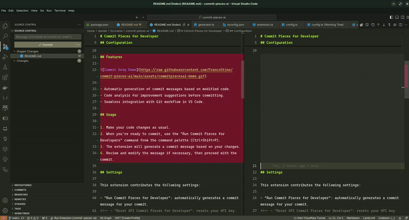

<div align="center">

# Commit AI - Pieces for Developers


---

[![Version][version-badge]][marketplace-url]
[![Installs][installs-badge]][marketplace-url]
[![Rating][rating-badge]][marketplace-url]
[![License][license-badge]][license-url]
[![Pieces for Developers][pieces-badge]][pieces-url]

[version-badge]: https://img.shields.io/visual-studio-marketplace/v/DavideLadisa.commit-pieces-ai?style=for-the-badge
[installs-badge]: https://img.shields.io/visual-studio-marketplace/i/DavideLadisa.commit-pieces-ai?style=for-the-badge
[rating-badge]: https://img.shields.io/visual-studio-marketplace/r/DavideLadisa.commit-pieces-ai?style=for-the-badge
[license-badge]: https://img.shields.io/github/license/FrancoStino/commit-pieces-ai?style=for-the-badge
[pieces-badge]: https://img.shields.io/badge/pieces-for%20developers-191919?style=for-the-badge&logo=data%3Aimage%2Fpng%3Bbase64%2CiVBORw0KGgoAAAANSUhEUgAAABQAAAAUCAQAAAAngNWGAAAB3UlEQVQoz11TTWgTQRj9IGya7UpEPMVuLagYkQr%20QOpRtOBJBBc8eyqCIHgrrYRiipeCCF715E2rULEU3cZWIqXUCtp68Kg0a8EF0WgS7TrveZidZDff6c03b773zTdvROJwxBusToXv%20Y8kqcKNWsUbcqQnhrN%20OWqyJ6KWXznWl6CV8sFLs6nYYAOqQ64vlfaYalbwQif%2F8g6KyDDDI5jBn5j6dXmkT0Tysj6pEy2eR4F3sYmPuIcBnoXpZXXaEbmyL%2FqllzdwEAGM5DaLuG5WratDUr2p8Q%2FafIbkVXzY%2FB7j2rSEbzVcQp5tfsElnMYsSHKHe7EQHw03hTsazilXkRcxigpy3AIJunhsNJQYoSfKVeBR9RCkjTcgt2Bxo9NMh%2FiIriJP4AGIfvWa5DWcRLfpjvSschU5hlG00a8WOAGHK12eknBNo6fKVWSdh3gAGea4H4uJGYQfpDah4XM1oEjyJ%20%2FDwm20Uq9euyVjhahBkqvIcRsk%20RkZfkpNNGp6g%20LIq3FthlM4gxUsYwTnkOJxfSovInLcCudJss4LyMLGZXxL0YLF4ayx2a5gXiebaKeLse6XdiccediaGzfmSPT22y8Xsz0et8UrVCeDtXiuUfiuWvbc7lf4Dx%2FMT2rumNvaAAAAAElFTkSuQmCC
[marketplace-url]: https://marketplace.visualstudio.com/items?itemName=DavideLadisa.commit-pieces-ai
[license-url]: https://github.com/FrancoStino/commit-pieces-ai/blob/main/LICENSE
[pieces-url]: https://pieces.app/

</div>

---

Commit AI - Pieces for Developers is a Visual Studio Code extension that uses the Pieces for Developers to enhance the code commit process.

## Configuration

To use Commit Pieces for Developers AI, you need to install **[Pieces for Developers](https://pieces.app/)**. Follow these steps:

1. You don't need any API key to use Commit Pieces for Developers.
2. Click on the Sparkle icon in the Source Control icon in the VS Code toolbar for use it.
3. Open the VS Code settings (File > Preferences > Settings).
4. Search for "Commit Pieces for Developers" in the settings to customize it.
5. Enjoy!

## Features



-   Automatic generation of commit messages based on modified code.
-   Code analysis for improvement suggestions before committing.
-   Seamless integration with Git workflow in VS Code.

## Usage

<!-- Insert icon svg Sparkle -->

1. Make your code changes as usual.
2. When you're ready to commit, use icon "Sparkle" in the Source Control toolbar or you can use the "Run Commit Pieces for Developers" command from the command palette (Ctrl+Shift+P).
3. The extension will generate a commit message based on your changes.
4. Review and modify the message if necessary, then proceed with the commit.

## Settings

This extension contributes the following settings:

- Model: You can select the model from the plugin configuration:

<style>
td {
vertical-align: middle;
}
</style>
<table>
    <thead>
        <tr>
            <th>Models</th>
            <th>Provider</th>
            <th>Type</th>
        </tr>
    </thead>
    <tbody>
        <tr>
            <td><code>chat-bison</code></td>
            <td></td>
            <td>Cloud</td>
        </tr>
        <tr>
            <td><code>claude-3-5-sonnet</code></td>
            <td><code>Anthropic</code></td>
            <td>Cloud</td>
        </tr>
        <tr>
            <td><code>claude-3-haiku</code></td>
            <td><code>Anthropic</code></td>
            <td>Cloud</td>
        </tr>
        <tr>
            <td><code>claude-3-opus</code></td>
            <td><code>Anthropic</code></td>
            <td>Cloud</td>
        </tr>
        <tr>
            <td><code>claude-3-sonnet</code></td>
            <td><code>Anthropic</code></td>
            <td>Cloud</td>
        </tr>
        <tr>
            <td><code>codechat-bison</code></td>
            <td><code>Google</code></td>
            <td>Cloud</td>
        </tr>
        <tr>
            <td><code>gemini-1.5-flash</code></td>
            <td><code>Google</code></td>
            <td>Cloud</td>
        </tr>
        <tr>
            <td><code>gemini-1.5-pro</code></td>
            <td><code>Google</code></td>
            <td>Cloud</td>
        </tr>
        <tr>
            <td><code>gemini-pro</code></td>
            <td><code>Google</code></td>
            <td>Cloud</td>
        </tr>
        <tr>
            <td><code>gpt-3.5-turbo</code></td>
            <td> <code>OpenAI</code></td>
            <td>Cloud</td>
        </tr>
        <tr>
            <td><code>gpt-3.5-turbo-16k</code></td>
            <td><code>OpenAI</code></td>
            <td>Cloud</td>
        </tr>
        <tr>
            <td><code>gpt-4</code></td>
            <td><code>OpenAI</code></td>
            <td>Cloud</td>
        </tr>
        <tr>
            <td><code>gpt-4-turbo</code></td>
            <td><code>OpenAI</code></td>
            <td>Cloud</td>
        </tr>
        <tr>
            <td><code>gpt-4o</code></td>
            <td><code>OpenAI</code></td>
            <td>Cloud</td>
        </tr>
        <tr>
            <td><code>gpt-4o-mini</code></td>
            <td><code>OpenAI</code></td>
            <td>Cloud</td>
        </tr>
    </tbody>
</table>

- Use Emojis: It allows you to enable or disable the use of emojis in commit messages.

- Custom Emojis: It allows you to write down the emojis you want to use in the next template object in the VSCode config.json.

```json
 "commit-pieces-ai.commitEmojis": {
  "feat": "✨",
  "fix": "🐛",
  "docs": "📝",
  "style": "💎",
  "refactor": "♻️",
  "test": "🧪",
  "chore": "📦",
  "revert": "⏪"
}
```

- Custom Summary Prompt: The prompt that will be used to generate the summary of all git diff.

- Custom Commit Prompt: The prompt that will be used to generate the commit message.

- Use Description: It allows you to enable or disable the use of commit description.

## Known Issues

There are currently no known issues. If you encounter any problems, please open an issue on our GitHub repository.

---

## For more information

-   [Pieces for Developer Documentation](https://docs.pieces.app/)
-   [Commit AI - Pieces for Developers GitHub Repository](https://github.com/FrancoStino/commit-pieces-ai)

---

>## Note
>**This extension is a community project and not officially supported by Pieces for Developers team.** 

---

**Happy coding with Commit AI - Pieces for Developers!**
